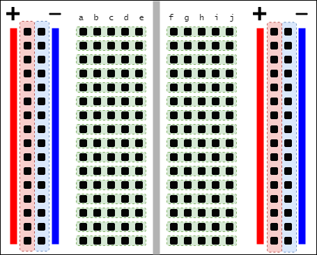
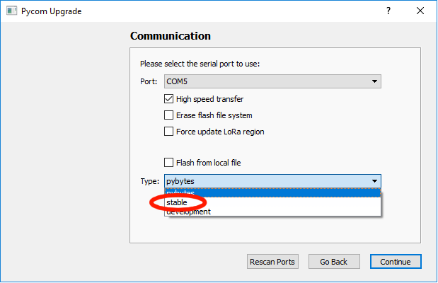

# Affärsverken IOT Startkit

This repository contains a few code examples to get started with Affärsverkens IOT Startkit.

## Hardware

The startkit contains the following assortment of parts

- [Pycom LoPy4](https://docs.pycom.io/gettingstarted/connection/lopy4)
- Pycom Expansion Board 2.0
- Pycom LoRa Antenna
- Magnetic Contact Switch
- Temperature and Humidity Sensor - [DHT22](https://learn.adafruit.com/dht/overview) incl. 4.7K - 10K pullup resistor
- Breadboard
- Jumper Wires

Pinout diagrams for the [LoPy4](https://docs.pycom.io/datasheets/development/lopy4) and the [Expansion Board](https://docs.pycom.io/datasheets/boards/expansion2)

The breadboard is used to make circuits without needing to solder. As showin in the image below the red and blue along the sides of the board are powerrails where you would connect power and ground for easy access across the board. The holes marked in green are connected row-wise `a` to `e` and `f` to `j`



## Software

You can find all the information about getting your machine set up for development in the [Pycom Documentation](https://docs.pycom.io/gettingstarted/installation)

If you are using Windows 7 you may need to install a [driver](https://docs.pycom.io/gettingstarted/installation/drivers) for the Expansion Board.

### LoPy4 Firmware Update

Before you begin, it is strongly recommended to upgrade the firmware of your LoPy4, you can find the update tool as well as instructions on how to perform an upgrade here:

https://docs.pycom.io/gettingstarted/installation/firmwaretool

Make sure you select the type `stable` before continuing.



The code examples in this repository are tested on stable firmware version `1.18.0`

### Development Environment

To upload the examples to a LoPy4 it is recommended to install the Pymakr plugin for either [Visual Studio Code](https://docs.pycom.io/pymakr/installation/vscode) or [Atom](https://docs.pycom.io/pymakr/installation/atom)

Once you have followed one of the guides above your editor of choice should be ready to go, make sure you've also followed the _Connecting via Serial USB_ instructions in these guides.

## Getting started

### The Things Network

Before you can connect to the testbed you need to register your device on The Things Network (TTN).

You start by creating an [application](https://www.thethingsnetwork.org/docs/applications/) on your account, this TTN application will be where you register your devices as well as handle [integrations](https://www.thethingsnetwork.org/docs/applications/integrations.html) with external services like a HTTP endpoint or even IFTTT.

Go to https://console.thethingsnetwork.org/applications and add an application for your startkit.

Then go into the newly created application and register your LoPy4 device. When filling out the registration, make sure that the _Device EUI_ field matches your LoRa4 module. A Device EUI is a unique identifier of a LoRa modem, similar to a MAC address of a network interface.

This next section will describe how to extract the DevEUI from your specific LoPy4.

#### Figuring out Device EUI

To find out the Device EUI of your LoPy4, connect to device console in your Pymakr editor (see the [Software](#software) section if you have not already done this)

Once you have a console open and can see the `>>>` prompt, you can open the `get_deveui.py` file, right-click inside the code and select the option `Pymakr > Run current file`

Or you can paste the code directly into the terminal:

```
from network import LoRa
import binascii
lora = LoRa()
print(binascii.hexlify(lora.mac()).decode())
```

Example output:

```
>>> print(binascii.hexlify(lora.mac()).decode())
0123456789abcdef
```

Where `0123456789abcdef` would be your Device EUI.

## Code examples

Before doing anything else, make sure you have connected the LoRa antenna


To run the code examples, open its folder in your development environment and make sure the terminal is connected (you should see a `>>>` prompt). You should then be able to press "Upload" to upload and run the example.

- `quick-start` - A minimal example of how to join a LoRaWAN network and send your first uplink package
- `door-sensor` - Send an uplink when a door is opened or closed
- `temperature-and-humidity` - Periodically send temperature and humidity values
