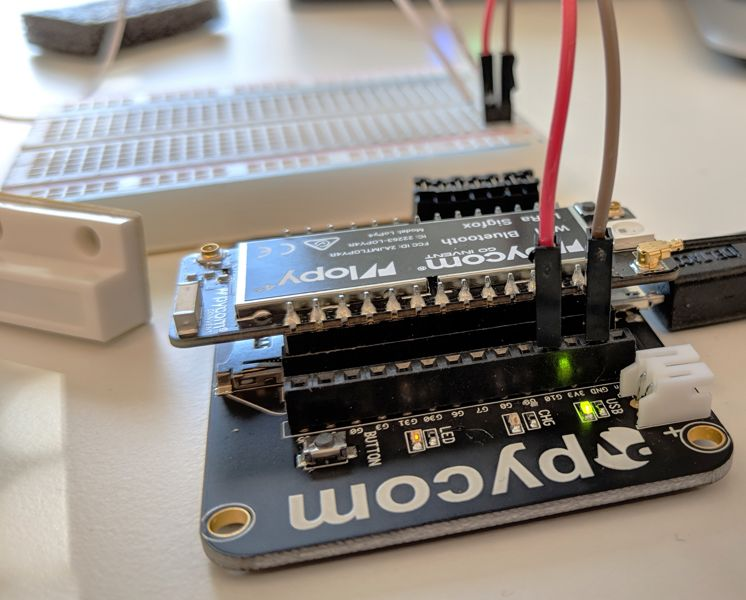

# Door Sensor

Send an uplink when a door is opened or closed

Before uploading the code, connect the magnetic contact switch to the LoPy4 `GND` and `G10` pins as in the pictures below. You might need to scale off a bit more of the plastic on the magnet switch for it to fit in the breadboard.

The orientation of the wires is not important.

