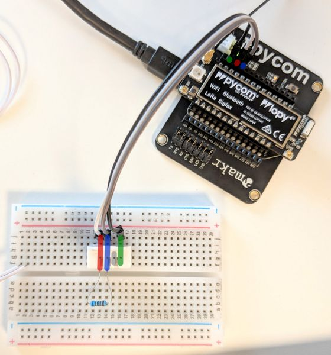

# Temperature & Humidity

Send temperature and humidity values every minute

The uplink data is converted from string to hex, use an online tool such as [Hex to ASCII](https://www.rapidtables.com/convert/number/hex-to-ascii.html) to convert it back to a readable string from TTN, or go into the _"Payload Formats"_ in your TTN application and write a decoder

The four pins of the DHT22, pin 3 is crossed out as it is not used.

Wiring up the DHT22 to the Expansion Board is done by connecting:

-   DHT22 `3v3` to Expansion Board `3v3`
-   DHT22 `GND` to Expansion Board `GND`
-   DHT22 `Data` to Expansion Board `G10`

You also need to connect the resistor between `3v3` and `Data` as seen in the pictures below:

